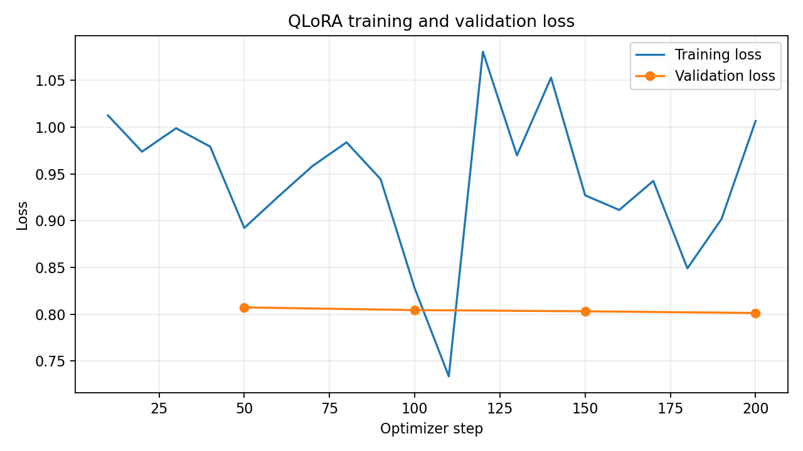

# Fine-Tuning Large Language Models: A Hands-On Tutorial with LoRA and QLoRA

**Course tutorial submission — written document + runnable code**

| | |
|---|---|
| **Author** | Sreeja Muvva |
| **Course / Section** | ARTI 4555/6555 (graduate section) |
| **Program** | MS in Artificial Intelligence |
| **Instructor** | *(instructor)* |
| **Date** | 2026-07-27 |
| **Work statement** | Completed individually, as required by the assignment. |

**Submitted materials**

| File | Type | Purpose |
|---|---|---|
| `Fine_Tuning_LLMs_Tutorial.md` (this file) | Written document | Complete tutorial: concepts, code, interpretation, exercises |
| `finetuning_tutorial.ipynb` | Runnable code | The full experiment: two datasets, base-vs-tuned evaluation, structured-JSON metrics, and the §11.6 challenge set |
| `finetuning_tutorial_executed.ipynb` | Evidence | The final run, fully executed, with all cell outputs, metrics, and the loss curve (§11.5–§11.6) |
| `results/` | Evidence | `metrics.json`, `loss_curves.png`, `environment.json`, and per-example base-vs-tuned prediction logs |
| `requirements.txt` | Environment | Pinned dependencies for local (non-Colab) runs |
| `presentation.mp4` *(optional)* | Recording | ~10-minute walkthrough (see §15 for the outline) |

> **Everything here runs on a single free Google Colab T4 GPU (16 GB).** No paid compute, no API keys, no private data.

---

## Table of contents

1. [How to use this tutorial](#1-how-to-use)
2. [Learning objectives](#2-objectives)
3. [Background: what is fine-tuning, and when should you do it?](#3-background)
4. [Two things people mean by "fine-tuning"](#4-two-meanings)
5. [Full fine-tuning vs. LoRA vs. QLoRA](#5-methods)
6. [The arithmetic: why LoRA and QLoRA actually fit](#6-arithmetic)
7. [Setup and version compatibility](#7-setup)
8. [Hands-on: QLoRA fine-tuning, end to end](#8-handson)
9. [Understanding every training argument](#9-args)
10. [Reading loss curves and avoiding overfitting](#10-loss)
11. [Evaluating the fine-tuned model](#11-eval)
12. [Saving, merging, and inference](#12-saving)
13. [Common pitfalls and troubleshooting](#13-pitfalls)
14. [Exercises](#14-exercises)
15. [Presentation outline](#15-presentation)
16. [Appendix A — the "vanilla" Hugging Face version](#16-vanilla)
17. [Appendix B — API-drift reference](#17-drift)
18. [Glossary](#18-glossary)
19. [Licensing, attribution, and reproducibility](#19-licensing)
20. [References and further reading](#20-references)

---

<a name="1-how-to-use"></a>
## 1. How to use this tutorial

**Who this is for.** Anyone in the class who has used a pretrained language model through an API or through `transformers`, and now wants to *change the model itself* rather than only its prompt. No prior fine-tuning experience is assumed. You should be comfortable with Python and basic PyTorch vocabulary (tensor, batch, gradient, epoch).

**What you will build.** A small instruction-following model, fine-tuned on a public dataset, that you can chat with — trained on a free GPU and evaluated against its own un-tuned baseline.

**Two ways to work through it:**

| Path | Time | What you do |
|---|---|---|
| **Read-only** | ~40 min | Read §3–§6 and §9–§11. You'll understand the method and the trade-offs without touching a GPU. |
| **Hands-on** | ~60–90 min | Open the notebook, run §8 top to bottom, then do at least one exercise from §14. |

**Realistic time budget for the hands-on path (free T4):**

| Step | Time |
|---|---|
| Install libraries | 2–5 min |
| Download + quantize the 1.5B model | 1–3 min |
| Train (2,000 examples, 1 epoch) | 9–25 min (measured: 9.4 min — §11.5) |
| Evaluate + generate | 3–5 min |

Training time varies a lot with sequence length and how busy Colab's backend is. If you are short on time, drop the dataset slice to 500 examples — every concept in this tutorial still applies.

**A note on version drift.** This is the single most common reason a fine-tuning tutorial fails to run. The libraries in this ecosystem make breaking changes every few months. §7 pins versions, the code in §8 detects the installed API automatically, and Appendix B lists the renames explicitly. If you only remember one thing from this tutorial's engineering side, remember to check the installed version before trusting any code you find online — including this document.

---

<a name="2-objectives"></a>
## 2. Learning objectives

By the end of this tutorial you will be able to:

1. Decide **when to fine-tune** versus when to prompt, retrieve, or use tools instead.
2. Distinguish the two training **objectives** (continued pretraining vs. supervised fine-tuning) from the three **adaptation methods** (full fine-tuning vs. LoRA vs. QLoRA), and explain why they are independent choices.
3. Compute, from a model's config file, **how many parameters LoRA will train** and roughly **how much VRAM** each method needs — before you launch a job.
4. Fine-tune a real open-source LLM end to end with QLoRA on a free GPU.
5. Explain what every important training hyperparameter does and how they interact.
6. Read a loss curve, recognize overfitting, and select a checkpoint on the right signal.
7. Choose evaluation metrics that match the task, and compare a fine-tuned model against its own baseline.
8. Save, merge, and deploy an adapter.

---

<a name="3-background"></a>
## 3. Background: what is fine-tuning, and when should you do it?

A pretrained LLM (Llama, Qwen, Mistral, …) already encodes a great deal about language and the world, learned by predicting the next token over trillions of tokens of text. **Fine-tuning** continues that training on *your* data so the model adapts to a task, a style, or a domain.

The important framing — and the one most tutorials skip — is that fine-tuning is often **not** the right tool.

| You want… | Best tool | Why |
|---|---|---|
| Answers grounded in facts that change, or that must be exact and citable | **Retrieval (RAG)** or tool use | Weights are a lossy, un-auditable place to store facts |
| A consistent output *format*, *style*, or *behavior* | **Fine-tuning (SFT)** | This is exactly what gradient updates are good at |
| The model to absorb a domain's *vocabulary and patterns* | **Continued pretraining** | Needs raw domain text, not instruction pairs |
| A task the model can already do, but done reliably every time | **Fine-tuning (SFT)** | Converts "can, sometimes" into "does, consistently" |
| A smaller/cheaper/local model that mimics a larger one | **Fine-tuning (distillation)** | Trains the small model on the large model's outputs |
| Better results with zero training budget | **Prompt engineering / few-shot** | Always try this first — it is free and instantly reversible |

**The mental model to keep:**

> Fine-tuning changes **how** the model behaves and what it is fluent in.
> Retrieval changes **what facts** it has in front of it at answer time.

For knowledge that is large, exact, or frequently changing, retrieval reliably beats trying to press the facts into the weights — a finding supported by direct comparison studies (Ovadia et al., 2024). This matters practically: a common failure mode is a team spending a week fine-tuning a model on a product manual, only to find that a fifteen-line retrieval pipeline answers the same questions more accurately and updates instantly when the manual changes.

**A useful decision sequence:**

```
Can a better prompt fix it?          -> do that
Is the gap about missing facts?      -> retrieval / tools
Is the gap about behavior or format? -> fine-tune (SFT)
Is the gap about domain fluency?     -> continued pretraining, then SFT
```

This tutorial covers the fine-tuning branch, but the branches above it are usually cheaper and should be ruled out first.

---

<a name="4-two-meanings"></a>
## 4. Two things people mean by "fine-tuning"

There are two distinct training **objectives**. They answer different questions and are often used in sequence.

### (a) Continued pretraining (domain-adaptive pretraining)

The model keeps doing plain **next-token prediction** on raw domain text — documents, articles, code, transcripts. There are no labels; the text is its own supervision.

- **Teaches:** domain vocabulary, terminology, phrasing conventions, writing patterns, some isolated facts.
- **Does not teach:** how to follow an instruction or produce a specific answer format.
- **Data looks like:** `"...continuous prose from your domain..."`

### (b) Supervised fine-tuning (SFT) / instruction tuning

The model trains on **(prompt → response)** pairs. Loss is ideally computed only on the response tokens, so the model learns to *produce* the response given the prompt, not to reproduce the prompt.

- **Teaches:** instruction following, output format, task behavior, tone.
- **Data looks like:** `{"user": "Summarize this abstract.", "assistant": "..."}`
- **This is what most people mean by "fine-tuning" today,** and it is what we do in §8.

### (c) Preference tuning (brief mention)

A later stage — DPO, GRPO, RLHF — nudges the model toward *preferred* answers using pairs of better/worse responses. It sharpens quality and safety after SFT has established basic competence. Beyond this tutorial's scope, but the same libraries (`trl`) implement it, so the code you learn here transfers directly.

**A common full recipe:**

```
base model  ->  (optional) continued pretraining on your raw text  ->  SFT on instruction pairs  ->  (optional) preference tuning
```

> **Key point:** objective (what loss you compute) and method (how many weights you update, §5) are **independent choices**. You can do continued pretraining with LoRA, or SFT with full fine-tuning. People conflate these constantly.

---

<a name="5-methods"></a>
## 5. Full fine-tuning vs. LoRA vs. QLoRA

These are **adaptation methods** — *how much* of the model you actually update.

### 5.1 Full fine-tuning

Update **every** weight in the model.

- Highest capacity to learn.
- Highest memory cost (see §6 — roughly **16 bytes per parameter** once you count weights, gradients, and optimizer state).
- Trains slowest, and **forgets** general abilities fastest, because nothing anchors the original behavior.

### 5.2 LoRA (Low-Rank Adaptation)

Freeze the original weights entirely. Inject small trainable **low-rank adapter** matrices alongside selected layers and train only those.

The idea in one line: instead of learning a full weight update `ΔW` (huge), learn

```
ΔW = (α / r) · B · A
```

where for a weight matrix `W ∈ ℝ^(d_out × d_in)`:

- `A ∈ ℝ^(r × d_in)` — initialized from a small random distribution
- `B ∈ ℝ^(d_out × r)` — **initialized to zero**, so `ΔW = 0` at step 0 and training starts exactly at the base model's behavior
- `r` is the **rank** (typically 8–64), and `α` is a scaling constant

Trainable parameters per adapted matrix: `r · (d_in + d_out)` instead of `d_in · d_out`. When `r` is small, that is a dramatic reduction (§6 works the numbers).

- **Cheaper, faster, and forgets less** — the base model is untouched, so its general abilities survive.
- Slightly less capacity than full fine-tuning for jobs requiring large amounts of genuinely new knowledge.
- Key knobs: **rank `r`** (capacity) and **`alpha`** (update scale; a common default is `α = 2r`).
- Adapters are **composable and portable**: a few megabytes on disk, swappable at inference, and you can keep several task adapters for one base model.

*Why does a low-rank update work at all?* The empirical claim behind LoRA is that the weight change needed to adapt a model to a downstream task has low "intrinsic rank" — the useful update lives in a small subspace, so a rank-16 approximation captures most of it. This is an empirical finding that holds well for style/format/behavior adaptation, and holds less well when you are trying to inject large volumes of new knowledge.

### 5.3 QLoRA (Quantized LoRA)

Load the frozen base model in **4-bit** precision to save memory, then train LoRA adapters on top in higher precision. Gradients flow *through* the quantized weights to the adapters; the 4-bit weights themselves are never updated.

- **Most memory-efficient.** A 7–8B model fits comfortably on a single free GPU.
- Quality is very close to LoRA, and the original paper found it can match 16-bit full fine-tuning performance on the benchmarks tested (Dettmers et al., 2023).
- **This is the recommended default for students on limited hardware** — and what we use in §8.

### 5.4 Quick comparison

| | Full FT | LoRA | QLoRA |
|---|---|---|---|
| Params updated | 100% | ~1% | ~1% |
| Base weight precision | 16-bit | 16-bit | **4-bit** |
| VRAM (7–8B model) | very high (needs sharding) | moderate | **low (single GPU)** |
| Training speed | slowest | fast | fast (small quantization overhead) |
| Forgetting risk | highest | low | low |
| Artifact produced | full model (GBs) | adapter (MBs) | adapter (MBs) |
| Best when | lots of data + big GPUs | standard adaptation | **limited hardware** |

---

<a name="6-arithmetic"></a>
## 6. The arithmetic: why LoRA and QLoRA actually fit

This section is what lets you predict, before launching a job, whether it will run. Work through it once and you will never again start a training run that OOMs at step 3.

### 6.1 Memory cost of full fine-tuning

For training with mixed precision and the Adam optimizer, per parameter you store roughly:

| Item | Bytes/param |
|---|---|
| Model weights (fp16/bf16) | 2 |
| Gradients (fp16/bf16) | 2 |
| Adam state: first moment `m` (fp32) | 4 |
| Adam state: second moment `v` (fp32) | 4 |
| fp32 master copy of weights | 4 |
| **Total** | **~16** |

So for full fine-tuning:

| Model size | Weights+grads+optimizer | Fits on a 16 GB T4? |
|---|---|---|
| 1.5B | ~24 GB | **No** |
| 7B | ~112 GB | No |
| 70B | ~1.1 TB | No |

Note that even a 1.5B model cannot be fully fine-tuned on a free T4 — and that is before activations, which add more depending on batch size and sequence length.

### 6.2 Memory cost of QLoRA

| Item | 1.5B model | 7B model |
|---|---|---|
| Base weights in 4-bit (~0.5 bytes/param) | ~0.8 GB | ~3.5 GB |
| LoRA adapters + their gradients + optimizer state | ~0.2 GB | ~0.9 GB |
| Activations (batch 2, seq 2048, with gradient checkpointing) | ~1–3 GB | ~3–6 GB |
| **Approximate total** | **~2–4.5 GB** | **~7–11 GB** |

Both fit on a free T4. That is the entire reason this tutorial is runnable in a classroom setting.

> **Measured.** A real run of §8 on a T4 peaked at **4.06 GB** (§11.5). The first version of this
> table predicted 2–4 GB, so the estimate was close but its upper bound was slightly low — which is
> the normal outcome for activation estimates, since they depend on the actual token-length
> distribution of your data rather than on `max_length`. Treat the range as a planning figure with
> ~25% headroom, not a guarantee.

### 6.3 How many parameters does LoRA actually train?

Let's compute it exactly for the model we use, **Qwen2.5-1.5B-Instruct**, whose architecture is:

| Config | Value |
|---|---|
| Hidden size (`d_model`) | 1536 |
| Layers | 28 |
| Attention heads | 12 (head dim 128) |
| Key/value heads | 2 (grouped-query attention) |
| MLP intermediate size | 8960 |

With `r = 16`, the trainable parameters per adapted matrix are `r · (d_in + d_out)`:

| Module | Shape (in → out) | LoRA params |
|---|---|---|
| `q_proj` | 1536 → 1536 | 16 × 3072 = 49,152 |
| `k_proj` | 1536 → 256 | 16 × 1792 = 28,672 |
| `v_proj` | 1536 → 256 | 16 × 1792 = 28,672 |
| `o_proj` | 1536 → 1536 | 16 × 3072 = 49,152 |
| `gate_proj` | 1536 → 8960 | 16 × 10496 = 167,936 |
| `up_proj` | 1536 → 8960 | 16 × 10496 = 167,936 |
| `down_proj` | 8960 → 1536 | 16 × 10496 = 167,936 |
| **Per layer** | | **659,456** |
| **× 28 layers** | | **≈ 18.5 M** |

Against ~1.54 B total parameters, that is **about 1.2%** — and roughly 74 MB on disk in fp32, or ~37 MB in fp16. Compare that to shipping a 3 GB fine-tuned model.

> **Do this yourself:** the numbers above come straight from the model's `config.json` on the Hugging Face hub. `print_trainable_parameters()` in the code will confirm the count. If your computed number and the printed number disagree, you targeted a different set of modules than you thought — a genuinely useful debugging check.

**Two things to notice.** First, the MLP projections (`gate`/`up`/`down`) dominate — they account for ~76% of the LoRA parameters here, because the intermediate size is nearly 6× the hidden size. Second, `k_proj` and `v_proj` are cheap because grouped-query attention shrinks their output dimension. If you need to cut adapter size, dropping the MLP modules saves far more than dropping attention modules — at some cost in quality.

---

<a name="7-setup"></a>
## 7. Setup and version compatibility

### 7.1 Environment

Use **Google Colab** with a GPU runtime: *Runtime → Change runtime type → T4 GPU*. Everything below also runs locally on any NVIDIA GPU with ≥8 GB VRAM.

We use **Unsloth**, which wraps Hugging Face `transformers` + `peft` + `trl` with hand-written kernels that make QLoRA notably faster and lighter, with no change to the math. Appendix A shows the same job in plain Hugging Face so you can see exactly what Unsloth is doing for you.

### 7.2 The version problem — read this before running anything

The SFT ecosystem has changed its API several times. Three things that appear in most older tutorials no longer work:

| Old (pre-2025 tutorials) | Current | Changed in |
|---|---|---|
| `SFTTrainer(..., tokenizer=tok)` | `SFTTrainer(..., processing_class=tok)` | TRL 0.16 |
| `SFTConfig(max_seq_length=2048)` | `SFTConfig(max_length=2048)` | deprecated in TRL 0.16, removed in 0.20 |
| `SFTTrainer(..., dataset_text_field="text")` | `SFTConfig(dataset_text_field="text")` | TRL 0.12 |

A large share of the SFT code currently on the open web still ships the retired signature. If you paste it, you get a `TypeError` on the first line of your training setup.

**The subtler trap: "latest" is not the version you want.** As of July 2026 the newest TRL on PyPI is **0.29.1** — but Unsloth's package metadata requires `trl>=0.18.2,<=0.24.0`. Installing the latest TRL gives you a resolver conflict or, worse, an environment that imports but misbehaves. The same applies to `transformers`: the latest is 5.14.1, while Unsloth supports `<=5.5.0`.

So the version you want is not the newest one — it is the newest one **inside your training framework's supported window**. Discover that window rather than guessing at it:

```python
# What does Unsloth actually support? Ask the installed package, don't guess.
from importlib.metadata import requires

for r in requires("unsloth") or []:
    if r.split()[0].split("[")[0] in {"trl", "transformers", "peft", "torch"}:
        print(r)
```

**Three defenses, and this tutorial uses all of them:**

1. **Pin inside the supported window** so the notebook is reproducible.
2. **Assert the resolved versions** at startup (Cell 2), so a bad resolution fails in two seconds rather than twenty minutes into training.
3. **Detect the installed API at runtime** (Cell 5), so the notebook survives the next rename.

### 7.3 Cell 1 — install

```python
# Cell 1 — install (Colab). Takes ~2-5 minutes.
#
# ONE pip command, on purpose: the resolver has to see every constraint at once.
# Installing unsloth first and then trl/transformers separately lets the second
# command silently upgrade them out of the window unsloth actually supports.
#
# The upper bounds below come from unsloth's own metadata (see 7.2), not guesswork.
# The trl>=0.20 lower bound guarantees the modern API this notebook is written
# against (max_length, processing_class).
!pip install -q unsloth "trl>=0.20,<=0.24" "transformers<=5.5.0" "peft>=0.18" accelerate bitsandbytes datasets

# If the install misbehaves on Colab, the dev build is sometimes ahead of PyPI:
# !pip install -q --upgrade --no-cache-dir "unsloth[colab-new] @ git+https://github.com/unslothai/unsloth.git"
```

### 7.4 Cell 2 — environment check

Always run this. It takes two seconds and saves an hour.

```python
# Cell 2 — verify GPU and record the exact environment
import torch, platform

assert torch.cuda.is_available(), "No GPU! Runtime -> Change runtime type -> T4 GPU"

gpu   = torch.cuda.get_device_name(0)
vram  = torch.cuda.get_device_properties(0).total_memory / 1e9
cc    = torch.cuda.get_device_capability()

# Real bf16 needs Ampere+ (compute capability 8.0+), which is exactly the check transformers
# performs. Do NOT use torch.cuda.is_bf16_supported() here: it defaults to
# including_emulation=True, and on a T4 it falls through to "can I allocate a bf16 tensor?"
# — which Turing can, in software. So it returns True on a T4, you set bf16=True, and the
# run dies much later inside SFTConfig with a confusing
# "Your setup doesn't support bf16/gpu" ValueError.
BF16  = cc[0] >= 8

print(f"GPU             : {gpu} ({vram:.1f} GB, compute capability {cc[0]}.{cc[1]})")
print(f"bfloat16 support: {BF16}   -> we will train in {'bf16' if BF16 else 'fp16'}")
print(f"Python          : {platform.python_version()} | torch {torch.__version__}")

import trl, transformers, peft
print(f"trl {trl.__version__} | transformers {transformers.__version__} | peft {peft.__version__}")

# Fail loudly NOW if the resolver drifted out of the window this notebook targets.
from packaging.version import parse as V
assert V("0.20") <= V(trl.__version__) <= V("0.24.0"), (
    f"trl {trl.__version__} is outside the 0.20-0.24 window this notebook targets. "
    "Below 0.20 the SFTConfig argument names differ; above 0.24 unsloth does not "
    "declare support. Re-run Cell 1, and see section 7.2."
)
```

> **Precision trap — and it is subtler than it looks.** A T4 is Turing architecture and has no *native* bfloat16, so hard-coding `bf16=True` — which many tutorials do, because their authors were on an A100 — fails on the free tier. That much is well known. The trap is that the obvious guard **does not work**: `torch.cuda.is_bf16_supported()` takes `including_emulation=True` by default, and when the hardware check fails it falls back to simply trying to allocate a bfloat16 tensor. Turing can do that in software, so the function returns `True` on a T4. Meanwhile `transformers` gates on compute capability ≥ 8.0. The two disagree, and the disagreement does not surface at Cell 2 where you would notice it — it surfaces several cells later, when `SFTConfig` is constructed, as `ValueError: Your setup doesn't support bf16/gpu`. Gate on the compute capability directly, as above, and the two agree by construction.

---

<a name="8-handson"></a>
## 8. Hands-on: QLoRA fine-tuning, end to end

> **This section and the notebook differ, deliberately.** §8 below is the minimal teaching
> path: one dataset, one model, the smallest code that shows how QLoRA works. The companion
> `finetuning_tutorial.ipynb` implements the stricter experiment used for the results in
> §11.5–§11.6, which adds:
>
> - **two datasets** — general Alpaca plus a deterministic structured-JSON task with exact
>   gold answers, so improvement can be measured rather than eyeballed
> - **three-way splits** (80/10/10) per source, with the test split never seen by the trainer
>   nor used for checkpoint selection
> - **TRL prompt-completion format** with `completion_only_loss=True`, the §8.7 upgrade
>   applied from the start
> - **both model conditions evaluated** — base and tuned on identical prompts, so every metric
>   has a baseline
> - **pinned model and dataset revisions**, recorded in `results/environment.json`
> - an **out-of-distribution challenge set** (§11.6)
>
> Read §8 to understand the mechanics; run the notebook to reproduce the results.


We fine-tune **Qwen2.5-1.5B-Instruct** on a slice of the public **Alpaca-cleaned** instruction dataset. Small model + small data = fast, reproducible, and it fits on a free GPU. The same code scales to 7–8B by changing one string.

### 8.1 Cell 3 — load the base model in 4-bit and attach LoRA adapters

```python
# Cell 3 — this is the "QLoRA" setup: 4-bit frozen base + trainable LoRA adapters
from unsloth import FastLanguageModel
import torch

MAX_SEQ_LEN = 2048
SEED        = 3407

model, tokenizer = FastLanguageModel.from_pretrained(
    model_name     = "unsloth/Qwen2.5-1.5B-Instruct",
    # Faster download (already quantized): "unsloth/Qwen2.5-1.5B-Instruct-bnb-4bit"
    # Scale up later with:                 "unsloth/Qwen2.5-7B-Instruct"
    max_seq_length = MAX_SEQ_LEN,
    load_in_4bit   = True,   # <- the "Q" in QLoRA
    dtype          = None,   # None = auto: fp16 on T4/V100, bf16 on Ampere+
)

model = FastLanguageModel.get_peft_model(
    model,
    r              = 16,            # LoRA rank -> capacity (see 6.3 for the param count)
    lora_alpha     = 32,            # update scale; ~2x rank is a solid default
    lora_dropout   = 0.05,          # light regularization; 0 is also common
    target_modules = ["q_proj", "k_proj", "v_proj", "o_proj",   # attention
                      "gate_proj", "up_proj", "down_proj"],     # MLP
    bias           = "none",
    use_gradient_checkpointing = "unsloth",   # big activation-memory saver
    use_rslora     = False,         # set True if you raise r to 64+
    random_state   = SEED,
)

model.print_trainable_parameters()   # compare this against your hand calculation from 6.3
```

> **Why target all seven modules?** Early LoRA work adapted only `q_proj` and `v_proj`. Adapting all linear layers, including the MLP, is now standard practice and generally gives better quality for a modest increase in adapter size. Exercise 6 asks you to test whether that holds here.

### 8.2 Cell 4 — load, format, and split the dataset

Instruction models are trained with a **chat template** — special tokens marking who is speaking. Always format your training data with the tokenizer's *own* template, and prompt the same way at inference. A mismatch here degrades quality quietly, with no error message, and it is one of the most common unexplained "my fine-tune made it worse" outcomes.

```python
# Cell 4 — load a public instruction dataset, apply the chat template, hold out a validation split
from datasets import load_dataset

raw = load_dataset("yahma/alpaca-cleaned", split="train[:2000]")   # 2k is plenty for a demo

def build_prompt(ex):
    """Alpaca rows have an optional 'input' field that supplements the instruction."""
    return ex["instruction"] if not ex["input"] else f'{ex["instruction"]}\n\n{ex["input"]}'

def format_example(ex):
    messages = [
        {"role": "user",      "content": build_prompt(ex)},
        {"role": "assistant", "content": ex["output"]},
    ]
    # add_generation_prompt=False -> we want the completed assistant turn, for training
    ex["text"] = tokenizer.apply_chat_template(messages, tokenize=False,
                                               add_generation_prompt=False)
    return ex

# Split BEFORE formatting. This keeps the original instruction/input/output columns on the
# held-out half, so section 11.3 can score ROUGE against data the model never trained on.
# (Formatting first and splitting after would leave us with only the 'text' column.)
split                = raw.train_test_split(test_size=0.15, seed=SEED)
raw_train, raw_eval  = split["train"], split["test"]

train_ds = raw_train.map(format_example, remove_columns=raw_train.column_names)
eval_ds  = raw_eval.map(format_example,  remove_columns=raw_eval.column_names)

print(f"train {len(train_ds)} | eval {len(eval_ds)}")
print("-" * 60)
print(train_ds[0]["text"][:600])   # ALWAYS eyeball one formatted example
```

**Read that printed example carefully.** You should see the model's control tokens (`<|im_start|>user`, `<|im_end|>`, `<|im_start|>assistant`) wrapping the content. If you see raw text with no special tokens, the template was not applied and your fine-tune will be trained on a format it will never see at inference time.

### 8.3 Cell 5 — compatibility shim

Ten lines that make the notebook survive TRL's next rename.

```python
# Cell 5 — detect the installed TRL API instead of assuming it
import inspect, trl
from dataclasses import fields
from trl import SFTConfig, SFTTrainer
from packaging.version import parse as V

_CFG_FIELDS      = {f.name for f in fields(SFTConfig)}
_TRAINER_PARAMS  = set(inspect.signature(SFTTrainer.__init__).parameters)
_NEW_TO_OLD      = {"max_length": "max_seq_length"}   # renamed in TRL 0.20

def make_sft_config(**kw):
    """Build an SFTConfig using modern names, downgrading them if TRL is older."""
    out = {}
    for k, v in kw.items():
        if k in _CFG_FIELDS:
            out[k] = v
        elif k in _NEW_TO_OLD and _NEW_TO_OLD[k] in _CFG_FIELDS:
            out[_NEW_TO_OLD[k]] = v
        else:
            print(f"[compat] SFTConfig does not accept '{k}' in trl {trl.__version__} — dropping it")
    return SFTConfig(**out)

if "processing_class" in _TRAINER_PARAMS:
    TOKENIZER_KW = "processing_class"
elif "tokenizer" in _TRAINER_PARAMS:
    TOKENIZER_KW = "tokenizer"
else:                                     # signature hidden behind **kwargs
    TOKENIZER_KW = "processing_class" if V(trl.__version__) >= V("0.16") else "tokenizer"

print(f"[compat] trl {trl.__version__}: passing the tokenizer as '{TOKENIZER_KW}'")
```

> `dataclasses.fields()` walks the inheritance chain, so `_CFG_FIELDS` also contains everything `SFTConfig` inherits from `TrainingArguments` — `learning_rate`, `eval_strategy`, `fp16`, and the rest. That is why the shim can validate the whole config, not just the SFT-specific parts.

### 8.4 Cell 6 — configure and run training

```python
# Cell 6 — supervised fine-tuning with TRL's SFTTrainer
import math

BATCH, ACCUM, EPOCHS = 2, 4, 1        # effective batch = BATCH x ACCUM = 8

# transformers 5.x deprecates warmup_ratio (removal in 5.2), so derive the step count
# ourselves and keep the same ~3% warmup the tutorial describes in section 9.
TOTAL_STEPS  = math.ceil(len(train_ds) / (BATCH * ACCUM)) * EPOCHS
WARMUP_STEPS = max(5, round(0.03 * TOTAL_STEPS))
print(f"~{TOTAL_STEPS} optimizer steps, {WARMUP_STEPS} of them warmup")

cfg = make_sft_config(
    output_dir                  = "outputs",
    dataset_text_field          = "text",
    max_length                  = MAX_SEQ_LEN,   # 'max_seq_length' on TRL < 0.20 (shim handles it)

    per_device_train_batch_size = BATCH,   # rows per GPU step
    gradient_accumulation_steps = ACCUM,   # -> effective batch = 8
    num_train_epochs            = EPOCHS,  # 1 epoch is enough for a demo
    learning_rate               = 2e-4,    # typical for LoRA/QLoRA
    lr_scheduler_type           = "cosine",
    warmup_steps                = WARMUP_STEPS,
    weight_decay                = 0.01,
    max_grad_norm               = 1.0,
    optim                       = "paged_adamw_8bit",

    fp16 = not BF16,     # T4 -> fp16
    bf16 = BF16,         # Ampere+ -> bf16

    logging_steps               = 10,
    eval_strategy               = "steps",
    eval_steps                  = 50,
    save_strategy               = "steps",
    save_steps                  = 50,
    load_best_model_at_end      = True,
    metric_for_best_model       = "eval_loss",
    greater_is_better           = False,
    save_total_limit            = 2,

    packing                     = False,  # keep False for instruction SFT
    seed                        = SEED,
    report_to                   = "none", # set "wandb"/"tensorboard" to log properly
)

trainer = SFTTrainer(
    model         = model,
    train_dataset = train_ds,
    eval_dataset  = eval_ds,
    args          = cfg,
    **{TOKENIZER_KW: tokenizer},
)

trainer_stats = trainer.train()
```

You will see training loss printed every 10 steps and validation loss every 50. Training loss should fall steadily; §10 explains how to interpret both.

> **Note on `load_best_model_at_end`.** This restores the checkpoint with the lowest *validation* loss rather than leaving you with the final step's weights. On a small dataset the last checkpoint is frequently not the best one, so this single argument is worth more than most hyperparameter tuning.

### 8.5 Cell 7 — training report

```python
# Cell 7 — record what actually happened (useful evidence for your write-up)
import math

peak_gb = torch.cuda.max_memory_reserved() / 1e9
runtime = trainer_stats.metrics["train_runtime"]

# Read the eval loss out of the training log rather than calling trainer.evaluate() again.
# Two reasons. (1) It was already computed during training, so re-running it costs time and
# tells you nothing new. (2) In a notebook, calling evaluate() standalone AFTER training has
# finished raises "RuntimeError: on_train_begin must be called before on_evaluate" — the
# progress-bar callback tears down its state in on_train_end and then refuses the orphaned
# on_evaluate. The metric is computed fine; only the display callback fails.
evals = [h["eval_loss"] for h in trainer.state.log_history if "eval_loss" in h]

# best_metric tracks metric_for_best_model, so it describes the checkpoint that
# load_best_model_at_end actually restored — which is the model now sitting in memory.
best = trainer.state.best_metric if trainer.state.best_metric is not None else min(evals)

print(f"Runtime        : {runtime/60:.1f} min")
print(f"Peak VRAM      : {peak_gb:.2f} GB of {vram:.1f} GB")
print(f"Evals recorded : {len(evals)}  (last {evals[-1]:.4f})")
print(f"Best eval loss : {best:.4f}   <- the restored checkpoint")
print(f"Perplexity     : {math.exp(best):.2f}")
```

Compare the peak VRAM figure against your prediction from §6.2. Being able to forecast this within a gigabyte or so is a practical skill.

### 8.6 Cell 7b — plot the loss curves

§10 asks you to *read* a loss curve; this cell draws it. The saved PNG is the figure to paste into your write-up — the reproducibility checklist in §19 requires both curves.

```python
# Cell 7b — training vs. validation loss, straight from the trainer's log history
import matplotlib.pyplot as plt

hist  = trainer.state.log_history
train = [(h["step"], h["loss"])      for h in hist if "loss"      in h]
val   = [(h["step"], h["eval_loss"]) for h in hist if "eval_loss" in h]

fig, ax = plt.subplots(figsize=(7, 4))
if train:
    ax.plot(*zip(*train), label="training loss", linewidth=1.5)
if val:
    ax.plot(*zip(*val), label="validation loss", marker="o", linewidth=1.5)

ax.set_xlabel("step")
ax.set_ylabel("loss")
ax.set_title("Training vs. validation loss")
ax.legend()
ax.grid(alpha=0.3)
plt.tight_layout()
plt.savefig("loss_curves.png", dpi=150)
plt.show()

if val:
    best_step, best_loss = min(val, key=lambda p: p[1])
    print(f"Best validation loss {best_loss:.4f} at step {best_step} "
          f"(this is the checkpoint load_best_model_at_end restored)")
```

If the validation line turns upward while the training line keeps falling, you are looking at the overfitting picture sketched in §10.1 — and the printed "best step" tells you where the useful model actually was.

### 8.7 Optional upgrade — train on responses only

The setup above computes loss over the **whole** formatted sequence, including the user's prompt. That works, and is what most introductory tutorials do, but it spends capacity teaching the model to generate *questions* — which is not the task.

Best practice is to mask the prompt tokens so loss is computed only on the assistant's reply. Two ways:

```python
# Option A — Unsloth helper (works with Qwen2.5 / ChatML templates)
from unsloth.chat_templates import train_on_responses_only

trainer = train_on_responses_only(
    trainer,
    instruction_part = "<|im_start|>user\n",
    response_part    = "<|im_start|>assistant\n",
)

# Option B — TRL native (requires a conversational 'messages' column instead of 'text',
# and a chat template containing  markers; TRL patches some model
# families automatically). Set assistant_only_loss=True in SFTConfig.
```

Expect the reported loss to **jump** when you enable this — that is correct and expected, not a bug. You are now averaging loss over a smaller, harder set of tokens, so the number is not comparable to the previous run. This is a specific instance of a general rule in §10.3: **loss values are only comparable between runs that score the same tokens.**

---

<a name="9-args"></a>
## 9. Understanding every training argument

| Argument | What it controls | Practical guidance |
|---|---|---|
| `learning_rate` | Size of each weight update | **LoRA/QLoRA: 2e-4.** Full fine-tuning: ~10× lower (1e-5–2e-5) or it forgets. |
| `per_device_train_batch_size` | Rows processed per GPU per step | As large as VRAM allows. Bigger = more stable gradients, more memory. |
| `gradient_accumulation_steps` | Steps to accumulate before updating | Simulates a large batch on a small GPU. **Effective batch = batch × accum × #GPUs.** Costs time, not memory. |
| `num_train_epochs` | Full passes over the data | Small datasets overfit fast — **1–3** is usually right. Let validation loss decide. |
| `max_length` | Tokens per training sequence | Longer = more memory (attention cost grows ~quadratically). 1024–2048 is typical. Check your data's actual length distribution before paying for 2048. |
| `warmup_steps` | Number of steps ramping the LR up | Target ~3% of total steps; prevents a large destabilizing first update. (`warmup_ratio` did this as a fraction, but transformers 5.x deprecates it — removal in 5.2.) |
| `lr_scheduler_type` | LR decay shape | `cosine` or `linear`; the difference is minor at this scale. |
| `weight_decay` | L2-style regularization | 0.01 is standard. |
| `max_grad_norm` | Gradient clipping cap | 1.0 — cheap insurance against loss spikes. |
| `optim` | Optimizer | `paged_adamw_8bit` for QLoRA: 8-bit states, and "paged" survives transient memory spikes. |
| `packing` | Concatenate short examples into one sequence | `True` for raw-text continued pretraining (efficiency); `False` for instruction SFT (clean per-example loss). |
| `gradient_checkpointing` | Recompute activations instead of storing them | Big memory win for ~20–30% slower steps. Unsloth's variant is the fastest option. |
| `seed` | Reproducibility | Always set it, and record it in your write-up. |
| `r` / `lora_alpha` | Adapter capacity / update scale | Start `r=16, alpha=32`. Raise `r` (32/64) if underfitting; add `use_rslora=True` at high rank. |
| `lora_dropout` | Adapter regularization | 0–0.1. Raise it if you overfit a small dataset. |

**The four that interact most:** batch size, gradient accumulation, learning rate, and gradient clipping together control *how fast and how stably* the model learns. A small effective batch produces noisier gradients, so pair it with a more modest learning rate. If you double the effective batch, you can often raise the LR somewhat — but for LoRA at this scale, 2e-4 is a robust default and is not where your time is best spent.

**Where your time actually pays off, in order:** (1) data quality, (2) correct chat formatting and response-only loss, (3) number of epochs / early stopping, (4) LoRA rank, (5) everything else. Beginners typically reverse this list.

---

<a name="10-loss"></a>
## 10. Reading loss curves and avoiding overfitting

### 10.1 What each curve tells you

- **Training loss** should fall smoothly (e.g. 1.9 → 1.4 → 1.2 …). Small step-to-step jitter is normal; it reflects batch composition, not instability.
- **Validation loss**, computed on data the model never trains on, is the honest signal. Hold out 15–20%.
- **Overfitting** = training loss keeps falling while validation loss flattens or **rises**. The model is memorizing rather than generalizing.
- **Early stopping** = stop when validation loss stops improving. On tiny datasets this can happen within a single epoch.
- **Select checkpoints on validation performance** (or a task metric) — **never** on the lowest training loss.

```
loss
 |  \                                   
 |   \___                                <- training loss: keeps falling
 |       \_____                          
 |  \                                    
 |   \____                               
 |         \____/‾‾‾‾                    <- validation loss: bottoms out, then rises
 |              ^                        
 |              |  the checkpoint you want
 +------------------------------------> steps
```

Cell 7b (§8.6) plots exactly this from your own run.

### 10.2 What to do about it

| Symptom | Diagnosis | Fix |
|---|---|---|
| Train ↓, val ↑ | Overfitting | Fewer epochs, more/augmented data, lower rank, raise `lora_dropout` |
| Both plateau high | Underfitting | Higher rank, higher LR, more epochs, check your data formatting |
| Loss spikes / NaN | LR too high, or fp16 instability | Lower LR, confirm `max_grad_norm=1.0`, check fp16 vs bf16 setting |
| Loss ~0 almost immediately | Data leakage, or trivially repetitive data | Inspect examples; check train/eval split for duplicates |
| Loss barely moves | LoRA not attached, or LR ~0 | Confirm `print_trainable_parameters()` is non-zero; check the scheduler |

> **Rule of thumb:** if you overfit, **add data** or **reduce capacity** (lower rank, higher dropout, fewer epochs). If you underfit, **raise capacity** (higher rank) or train longer.

### 10.3 The comparability rule

A loss number is meaningless in isolation. Two runs' losses are only comparable if they score **the same tokens on the same data with the same tokenizer**. Changing the chat template, enabling response-only loss, or changing `max_length` all change what is being averaged. Cross-run comparisons that ignore this are one of the most common errors in student fine-tuning reports — and in published ones.

---

<a name="11-eval"></a>
## 11. Evaluating the fine-tuned model

**Match the metric to the task.** No single number is sufficient, and loss alone tells you nothing about whether the model is *useful*.

| Metric | What it measures | Good for |
|---|---|---|
| **Perplexity** = `exp(loss)` | How surprised the model is by held-out text (lower is better) | Language modeling, continued pretraining |
| **Exact Match (EM)** | Fraction of outputs identical to the gold answer | Short factual answers, classification |
| **Token-level F1** | Word overlap with the reference (partial credit) | Short free-form answers |
| **ROUGE-1/2/L** | Unigram / bigram / longest-common-subsequence overlap | Summaries, longer generations |
| **BLEU** | n-gram precision vs. reference, with brevity penalty | Translation, constrained generation |
| **BERTScore** | Semantic similarity via embeddings | When wording varies but meaning matters |
| **Task accuracy** | % correct on a labeled test set | Any classification-style task |
| **Human / rubric scoring** | Whatever you actually care about | Everything — and it is what the others approximate |

> **Caution on n-gram metrics.** ROUGE and BLEU reward surface overlap with one reference answer. For open-ended instruction following there are many good answers, so a low ROUGE score does not necessarily mean a bad model. Use them as a *relative* signal between your own runs, never as an absolute quality claim.

### 11.1 Cell 8 — generation helper

```python
# Cell 8 — inference helper
from unsloth import FastLanguageModel
import torch

FastLanguageModel.for_inference(model)   # ~2x faster generation

@torch.no_grad()
def generate(prompt, max_new_tokens=192, greedy=True):
    msgs   = [{"role": "user", "content": prompt}]
    # return_dict=True gives us input_ids AND a correct attention_mask. Building the
    # mask by hand with torch.ones_like() is wrong the moment anything is padded.
    inputs = tokenizer.apply_chat_template(
        msgs, tokenize=True, add_generation_prompt=True,
        return_dict=True, return_tensors="pt",
    ).to(model.device)

    # Only pass sampling knobs when actually sampling; handing temperature/top_p to a
    # greedy call just produces warnings.
    sampling = dict(do_sample=False) if greedy else dict(
        do_sample=True, temperature=0.7, top_p=0.9,
    )

    out = model.generate(
        **inputs,
        max_new_tokens = max_new_tokens,
        pad_token_id   = tokenizer.pad_token_id or tokenizer.eos_token_id,
        **sampling,
    )
    prompt_len = inputs["input_ids"].shape[1]
    return tokenizer.decode(out[0][prompt_len:], skip_special_tokens=True)

print(generate("Explain LoRA to a beginner in two sentences."))
```

> Use **greedy decoding** for any before/after comparison. Sampling adds variance that will swamp the effect you are trying to measure, and you will end up drawing conclusions from noise.

### 11.2 Cell 9 — the comparison that matters: base vs. fine-tuned

Because LoRA leaves the base weights untouched, you can toggle the adapter off and get the original model back from the same memory — no second model load required.

```python
# Cell 9 — same weights, adapter on vs. off
PROMPTS = [
    "Give three tips for writing clear code.",
    "Summarize the water cycle in exactly two sentences.",
    "Return a JSON object with keys item and quantity for: five notebooks.",
    "What is the capital of Australia?",
    raw_structured_test[0]["prompt_text"],   # a held-out structured record — the taught task
]

for p in PROMPTS:
    with model.disable_adapter():          # <- base model behavior
        before = generate(p)
    after = generate(p)                    # <- fine-tuned behavior
    print("=" * 78)
    print("PROMPT :", p)
    print("\n[BASE]\n", before)
    print("\n[TUNED]\n", after)
```

*If `disable_adapter()` raises an error in your version, load the base model separately in a fresh runtime and save both sets of outputs to compare offline.*

**Score these by hand.** For a class deliverable this manual table is stronger evidence than any automatic metric:

Scored by hand from the final run's `results/qualitative_comparison.jsonl`. Prompts 3 and 5 are
formatting tasks (the behavior being taught); prompts 1, 2 and 4 are open-ended controls.

| # | Prompt | Followed instruction | Factually OK | Better than base? |
|---|---|---|---|---|
| 1 | Three tips for clear code | ✓ (both) | ✓ | **≈ no change** — both list three well-formed tips; tuned is slightly reworded, not better or worse |
| 2 | Water cycle in exactly two sentences | ✓ (both) | ✓ | **= identical** — both produced the *same* two-sentence answer, verbatim |
| 3 | Return a JSON object (item, quantity) | base ✗ / tuned ✓ | ✓ | **✓ better** — base wrapped it in a ` ```json ` fence with prose ("Here is the JSON object you requested…"); tuned returned bare `{"item": "notebooks", "quantity": 5}` |
| 4 | Capital of Australia | ✓ (both) | ✓ | **= unchanged** — both answered Canberra |
| 5 | Held-out company record → JSON | base ✗ / tuned ✓ | ✓ (both fields correct) | **✓ better** — the prompt says "Return JSON only—no markdown"; base still fenced it, tuned obeyed and emitted bare JSON with every field correct |

The pattern is consistent with §11.5: the fine-tune's visible effect is **format compliance on
the taught task** (prompts 3 and 5), not a change in open-ended quality (prompts 1, 2, 4). On the
two JSON prompts the base model's content is correct but it disobeys "JSON only" by adding
markdown fences and prose; the tuned model strips both. Contrast this with run 1's Alpaca-only
result (§11.5), where the tuned model was never clearly better and sometimes worse — because that
run taught no specific task. Teaching a concrete output contract is what makes the qualitative
difference show up.

Note prompt 2 is answered *identically* by both models — a useful control: it shows the adapter
left an unrelated capability untouched rather than perturbing it. Prompt 4 deliberately tests a
**fact**, not a behavior; both get Canberra, reinforcing §3 — fine-tuning is not a
knowledge-injection tool.

### 11.3 Cell 10 — an automatic metric

Because Cell 4 split the dataset *before* formatting, `raw_eval` still has the original `instruction` / `input` / `output` columns — and the model has never seen any of it. Scoring against the head of the training set instead would inflate every number here.

```python
# Cell 10 — ROUGE against HELD-OUT references (data the model never trained on)
!pip install -q evaluate rouge_score
import evaluate

n       = 25
sample  = raw_eval.select(range(min(n, len(raw_eval))))
refs    = sample["output"]
prompts = [build_prompt(ex) for ex in sample]     # same prompt construction as training
preds   = [generate(p, max_new_tokens=256) for p in prompts]

rouge = evaluate.load("rouge")
print(rouge.compute(predictions=preds, references=refs))
```

### 11.4 Checking for damage

Fine-tuning can degrade general ability while improving your target task. To check, run a standard benchmark **before and after** with the [lm-evaluation-harness](https://github.com/EleutherAI/lm-evaluation-harness) — MMLU for knowledge, GSM8K for arithmetic reasoning, ARC for science QA. A few points of drop on a narrow fine-tune is normal; a large drop means your learning rate is too high, you trained too long, or your data is too narrow.

> **Frameworks worth knowing:** `evaluate` (ROUGE/BLEU/BERTScore/EM), **lm-evaluation-harness** (standardized benchmarks), and **DeepEval** (pytest-style LLM tests with an LLM-as-judge). Treat LLM-as-judge scores as a *secondary* signal — judges have known biases toward length, verbosity, and their own family of models.

### 11.5 Results from actual runs

Two experiments are reported. Read them together — the pair is the finding. Run 1 is the
earlier Alpaca-only experiment (the negative result). Run 2 is the final experiment produced by
the accompanying notebook, and the numbers below come from that complete, executed run.

> **These are final numbers from a clean end-to-end run.** Run 2 and the §11.6 challenge tables
> were regenerated from the executed notebook (`finetuning_tutorial_executed.ipynb`, all outputs
> saved under `results/`): the Alpaca ROUGE sample is the full 100 examples, the challenge set
> is 48 records, and the `strict_json_only_rate` metric is included.
>
> **Reference hardware.** The final run was executed on an **NVIDIA RTX A5000 (25 GB, Ampere,
> compute 8.6)**, so it selects **bf16** per Cell 2's capability check. This does not change the
> tutorial's "runs on a free T4" claim: peak VRAM was **2.19 GB**, leaving large headroom inside
> a T4's 16 GB. A T4 would run the same code in fp16; expect its numbers to differ slightly from
> the bf16 figures here, and its runtime to be longer.

#### Run 1 — Alpaca only (2026-07-27)

| | |
|---|---|
| GPU / precision | Tesla T4, 15.6 GB, capability 7.5 → fp16 |
| Libraries | unsloth 2026.7.5, trl 0.24.0, transformers 5.5.0, peft 0.19.1 |
| Data | `yahma/alpaca-cleaned` `train[:2000]` → 1,700 / 300 |
| LoRA trainable parameters | 18,464,768 (1.1820%) — matches §6.3 exactly |
| Peak VRAM | 4.06 GB of 15.6 |
| Runtime | 9.4 min (213 steps) |
| Best validation loss / perplexity | 1.0211 / 2.78 |
| ROUGE-1 / 2 / L | 0.525 / 0.306 / 0.401 |

`trl` and `transformers` resolved to **exactly** the ceilings §7.2 derives from Unsloth's
metadata (0.24.0 and 5.5.0) — the version analysis confirming itself against a real resolver.

**The result was negative.** Across five open-ended prompts (run 1's earlier prompt set, which
included a bulleted-list task) the fine-tuned model was never clearly better, was
indistinguishable on three, and was worse on two — most visibly turning `- Milk` into
`- We need milk.` (The §11.2 table now shows run 2's prompt set, which exercises the JSON task
run 2 actually teaches.)

That is the experiment working. Qwen2.5-1.5B-**Instruct** is already instruction-tuned, and
Alpaca is distilled from a weaker GPT-3-era teacher, so SFT taught a strong model to imitate a
worse one. Validation loss fell while human-visible quality did not improve — §10.3's warning
demonstrated rather than asserted. Note also that run 1 lacked a base-model arm on ROUGE, so
its 0.525 cannot be compared to anything; run 2 fixed that.

#### Run 2 — structured task + general replay

Run 2 changed the experiment rather than the hyperparameters: it added a deterministic
**company-record → JSON** task with exact, field-level gold answers, and mixed it with general
Alpaca data. Both model conditions are evaluated on untouched test splits.

| | |
|---|---|
| GPU / precision | NVIDIA RTX A5000, 25.3 GB, capability 8.6 → bf16 |
| Libraries | unsloth 2026.7.5, trl 0.24.0, transformers 5.5.0, peft 0.19.1, torch 2.10.0+cu128 |
| Data | 1,120 Alpaca + 480 structured = 1,600 train; independent 200 validation and 200 test |
| Loss | `completion_only_loss=True` — assistant tokens only |
| LoRA trainable parameters | 18,464,768 (1.1820%) — matches §6.3 exactly |
| Runtime / peak VRAM | 5.1 min (200 steps) / 2.19 GB |
| Best validation loss / perplexity | 0.8013 / 2.23 |



Training loss shows the expected batch-level jitter at effective batch size 8; validation loss
falls monotonically across all four checkpoints (0.807 → 0.801) and is lowest at the final step,
so `load_best_model_at_end` restored the step-200 checkpoint. The near-flat validation curve is
the honest signal here: one epoch on a strong instruct model moves validation loss very little,
and the task-level metrics below — not the loss delta — are where the fine-tune shows up.

**Structured JSON, 60 held-out examples**

| Metric | Base | Tuned | Δ |
|---|---|---|---|
| `strict_json_only_rate` | 0.000 | 1.000 | **+1.000** |
| `all_fields_exact_rate` | 0.750 | 1.000 | **+0.250** |
| `city_accuracy` | 0.800 | 1.000 | +0.200 |
| `employee_count_accuracy` | 0.967 | 1.000 | +0.033 |
| `supply_chain_role_accuracy` | 0.967 | 1.000 | +0.033 |
| `exact_key_order_rate` | 0.950 | 1.000 | +0.050 |
| `valid_json_rate` | 1.000 | 1.000 | 0.000 |

Note that `valid_json_rate` is *not* the headline: the base model already produced parseable JSON
every time (once markdown fences and prose are stripped). The two results that matter are
`strict_json_only_rate` and `all_fields_exact_rate`. The base model **never** returned bare JSON —
it wrapped every answer in ` ```json … ``` ` fences or explanatory prose, so its
`strict_json_only_rate` is 0.000 even though its content is recoverable. The fine-tune's single
largest effect is teaching the model to obey "Return JSON only": 0.000 → 1.000. Field-level
correctness and key ordering improve on top of that.

**Held-out Alpaca ROUGE, base vs. tuned** *(n = 100 held-out examples, generated twice — once per model condition)*

| Metric | Base | Tuned | Δ |
|---|---|---|---|
| ROUGE-1 | 0.412 | 0.455 | +0.043 |
| ROUGE-2 | 0.179 | 0.217 | +0.038 |
| ROUGE-L | 0.286 | 0.333 | +0.047 |

Every ROUGE delta is positive: on data the model never trained on, the fine-tune did **not**
degrade surface overlap with the reference answers — it modestly improved it. This is a
no-regression result on general instruction-following, not evidence of a large capability gain.

> **A measured noise floor.** An earlier repeat of this experiment from the same seed established
> the run-to-run wobble directly: training was bit-identical (same best validation loss at step
> 200 both times) and the *base* model's ROUGE matched to 16 decimal places, but the *tuned*
> model's ROUGE-1 did not — greedy decoding through the adapter is not bit-reproducible on this
> stack, giving roughly **±0.007 ROUGE-1** of jitter. The +0.043 delta above is about six times
> that floor, so it survives; a delta of 0.01 would not have. This final run was executed once,
> so treat the deltas as point estimates above a known ±0.007 floor. Report a noise floor
> whenever you report a small metric difference.

#### What these numbers do and do not establish

The structured improvement is large and measured against exact gold values, so it is solid
evidence that QLoRA adapted the model to a clearly specified output task. Beyond that, be
careful:

- **A perfect score is not saturation.** 100% on 60 examples is perfect performance *on those
  60 examples*. It does not show the task is solved, and it does not show further training
  cannot help. §11.6 exists because of exactly this.
- **Best validation loss at the final step is not proof of underfitting.** It shows only that
  validation loss had not yet worsened. Longer training might help, do nothing, or begin
  overfitting; settling that needs an epoch ablation.
- **The ROUGE change is modest, and ROUGE is a surface-overlap metric.** It says nothing about
  reasoning, factuality, or hallucination. The defensible claim is that *no degradation
  appeared on the sampled held-out Alpaca data* — not that general capability was preserved.
- **Replay is not proven to be the cause.** Mixing general data with task data is a plausible
  explanation for the absence of regression, but demonstrating it requires the ablation in
  §14 Exercise 9: the same run with and without replay, compared on both suites.
- One model, one seed, small test sets. Nothing here generalises without repetition.

> **On run 2's `Evals recorded` count.** Run 1's report printed 7; only 4 came from the
> `eval_steps` cadence. The rest were duplicate entries at the final step logged by standalone
> `trainer.evaluate()` calls that computed successfully before failing in the notebook display
> callback (§13.2). Report the cadence count, not the log length.

### 11.6 Separating extraction from template memorisation

The §11.5 structured test is drawn from the **same four record templates and twelve cities**
used in training; only company names and numbers differ. A model can score 100% there by
learning "the third field of template B is the headcount" without learning to extract
anything. A perfect in-distribution score is therefore consistent with two very different
models, and the metric alone cannot tell them apart.

The notebook's §11b builds a challenge set that holds the task fixed and changes only the
surface:

| Dimension | In-distribution test | Challenge set |
|---|---|---|
| Record templates | the 4 seen in training | 6 unseen (prose, memo, bullets, pipe-delimited, Q&A, dossier) |
| Cities | the 12 seen in training | 12 unseen |
| Company names | `{Prefix} {Noun} {Suffix}` grid | off-grid (`Ohm & Sons Manufacturing`, `3Rivers Composites`) |
| Headcount format | bare integer | also `2,634` and `approximately 4,960` |
| ISO-9001 phrasing | `yes` / `certified` / `no` / `not certified` | `holds ISO 9001`, `accredited to ISO 9001`, `lacks ISO 9001 certification` |
| Distractor sentences | none | one per record, carrying no schema field |

The instruction wrapper is byte-identical to training — the notebook asserts this at runtime —
so the only variable is record format.

**The number to report is the gap**, `all_fields_exact_rate` in-distribution minus challenge.
A small gap indicates the adapter learned to extract fields; a large gap indicates it learned
the four training templates. Either outcome is publishable in a write-up; only the
in-distribution number alone is not.

#### Final results — 48 records

| Metric | Base | Tuned | Δ |
|---|---|---|---|
| `strict_json_only_rate` | 0.000 | **1.000** | +1.000 |
| `all_fields_exact_rate` | 0.438 | **0.562** | +0.125 |
| `supply_chain_role_accuracy` | 0.458 | 0.583 | +0.125 |
| `city_accuracy` | 0.854 | 0.958 | +0.104 |
| `company_name_accuracy` | 1.000 | 1.000 | 0.000 |
| `employee_count_accuracy` | 1.000 | 1.000 | 0.000 |
| `iso_9001_accuracy` | 1.000 | 1.000 | 0.000 |
| `valid_json_rate` | 1.000 | 1.000 | 0.000 |
| `exact_key_order_rate` | 1.000 | 1.000 | 0.000 |

95% Wilson intervals (n=48): base `all_fields_exact_rate` **0.438 [0.307, 0.577]**, tuned
**0.562 [0.423, 0.693]** — the intervals overlap, so the +0.125 out-of-distribution gain is a
direction, not a settled quantity. The `strict_json_only_rate` jump (0 → 1.000) is the one
unambiguous effect: as in-distribution, the base model never emits bare JSON on these records
and the tuned model always does.

**The generalisation gap is 0.438** — the tuned model scores 1.000 in-distribution and 0.562
on the challenge set. Three things follow, and the third is the one most write-ups would miss.

**1. The adapter learned more than the four templates.** It beats the base model on
out-of-distribution records by +0.125 exact-match. Had it merely memorised template slot
positions, it would have collapsed toward the base model on unseen formats. It did not — though
with overlapping confidence intervals (above), read this as direction, not a precise size.

**2. But nearly half of the in-distribution score does not transfer.** The perfect 1.000 in
§11.5 drops to 0.562 on records whose *shape* the adapter has not seen. That number alone
substantially overstates what the adapter can do out of distribution — which is the entire
reason this section exists.

**3. Some of the gap is the task getting harder, not the adapter overfitting.** The base model
also drops on the challenge set, from 0.750 to 0.438 — a fall of 0.312 without any fine-tuning
involved. So the challenge records are intrinsically harder for both conditions, and only the
*excess* of the tuned drop over the base drop (0.438 versus 0.312, i.e. **0.125**) is
attributable to the adapter being more template-dependent than the base model. A write-up that
reported the 0.438 gap as pure overfitting would be wrong; the base-model arm is what makes this
distinguishable, and it is the reason both conditions must always be evaluated.

**The gain is concentrated in one template, not spread evenly.** Per-template
`all_fields_exact_rate` on the 8 records of each format tells a sharper story than the aggregate:

| Template | Base | Tuned |
|---|---|---|
| prose | 1.000 | 1.000 |
| memo | 1.000 | 1.000 |
| qa | 0.125 | **0.875** |
| pipe | 0.250 | 0.250 |
| dossier | 0.250 | 0.250 |
| bullets | 0.000 | 0.000 |

The entire out-of-distribution improvement comes from the **qa** format (0.125 → 0.875). Prose
and memo were already solved by *both* models; `pipe`, `dossier`, and `bullets` did not move at
all, and `bullets` fails completely for both conditions. So "the adapter generalises" is too
coarse: it generalises to one unfamiliar layout and not to three others. The aggregate +0.125
is an average over a spiky distribution, which is exactly why the per-template and interval
views belong in the report.

**Where the failures are.** The failures are dominated by one field: of the 21 tuned records
that miss `all_fields_exact`, **20 have a wrong `supply_chain_role`**. The tuned model scored
1.000 on company name, employee count, and ISO status, 0.958 on city (2 errors, down from the
base model's 7), and 0.583 on role. `role_accuracy` (0.583) and `all_fields_exact_rate` (0.562)
differ by just one record — a single case where the role is right but the city is wrong — so to
a first approximation, *fixing role would fix the challenge set*. That is a sharp, actionable
diagnosis rather than a diffuse "it got worse".

Note what separates that field from the others: company name, city, and headcount are **literal
spans** to copy out of the record, while `supply_chain_role` is a **closed-set label** the model
must select. The results are consistent with the adapter having learned robust span extraction
and less robust label classification under unfamiliar phrasing — but that is a hypothesis
suggested by the metrics, not something they establish. Confirming it means reading
`results/challenge_tuned_predictions.jsonl` to see whether the wrong roles are, for example,
inferred from the product name rather than the stated role. Exercise 10 pursues this.

> **Scope.** 48 challenge records and 60 in-distribution records, one model, one seed. These
> are small-sample estimates; a ±1 example change moves `all_fields_exact_rate` by 0.021 on the
> challenge set, and the 95% intervals above overlap. Treat the gap as an indication of
> direction and rough magnitude, not a precise quantity.

---

<a name="12-saving"></a>
## 12. Saving, merging, and inference

```python
# Cell 11 — save the adapter (tens of MB, not gigabytes)
model.save_pretrained("lora_adapter")
tokenizer.save_pretrained("lora_adapter")
```

To ship a single standalone model (base + adapter fused):

```python
# Merge into 16-bit weights
model.save_pretrained_merged("merged_model", tokenizer, save_method="merged_16bit")

# Or export GGUF to run locally in Ollama / llama.cpp
# model.save_pretrained_gguf("gguf_model", tokenizer, quantization_method="q4_k_m")
```

Reloading later:

```python
from unsloth import FastLanguageModel
model, tokenizer = FastLanguageModel.from_pretrained(
    model_name = "lora_adapter",     # adapter dir; the base is fetched automatically
    max_seq_length = 2048,
    load_in_4bit = True,
)
FastLanguageModel.for_inference(model)
```

| Format | Size | Best for |
|---|---|---|
| **Adapter only** | tens of MB | Sharing, versioning, serving many tasks from one base model |
| **Merged 16-bit** | GBs | Simple deployment; standard inference servers (vLLM, TGI) |
| **GGUF quantized** | ~1 GB for 1.5B | Local/CPU inference via Ollama or llama.cpp |

> **A note on merging quantized models.** Merging a LoRA adapter that was trained on a 4-bit base into 16-bit weights introduces a small numerical discrepancy, since training saw the quantized weights and the merge targets dequantized ones. In practice the effect is minor, but if quality matters, evaluate the merged model rather than assuming it matches the adapter-based one.

---

<a name="13-pitfalls"></a>
## 13. Common pitfalls and troubleshooting

### 13.1 Conceptual pitfalls

- **Overfitting tiny datasets.** A few hundred examples overfit fast. Keep epochs low; watch validation loss.
- **Catastrophic forgetting.** Aggressive learning rates and full fine-tuning erase general abilities. Prefer LoRA/QLoRA, use a modest LR, and mix in 5–20% general instruction data ("replay") when training heavily on a narrow domain.
- **Wrong chat template.** Format training data with `tokenizer.apply_chat_template`, and prompt identically at inference. Mismatches quietly destroy quality with no error.
- **Judging by training loss.** Low training loss ≠ good model. Pick checkpoints on validation or task metrics.
- **Evaluating on training data.** Split *before* you transform, so the held-out rows keep the fields your metric needs. Scoring the head of the training set is the easiest way to report a number that means nothing.
- **Learning rate too high.** The number-one cause of unstable or degraded fine-tunes.
- **Trying to memorize exact facts.** Fine-tuning is poor at storing exact, changing facts. Use retrieval. Fine-tune for behavior, style, and format.
- **Not fixing seeds or logging configs.** Set `seed`, log hyperparameters and metrics (W&B or TensorBoard), and your results become defensible.
- **Comparing incomparable losses.** See §10.3.
- **Installing "the latest" of everything.** The newest release is not the compatible one. Pin inside your framework's supported window (§7.2).

### 13.2 Error-message troubleshooting

| Symptom | Cause | Fix |
|---|---|---|
| `ResolutionImpossible` / `pip` backtracks forever | Asking for a `trl` or `transformers` version outside Unsloth's supported range | Use the single pinned `pip install` from Cell 1; see §7.2 |
| `TypeError: ... unexpected keyword argument 'tokenizer'` | TRL ≥ 0.16 | Use `processing_class=` (Cell 5 handles this) |
| `TypeError: ... 'max_seq_length'` | TRL ≥ 0.20 | Use `max_length=` in `SFTConfig` |
| `TypeError: ... 'dataset_text_field'` on `SFTTrainer` | Moved to config | Put it in `SFTConfig`, not the trainer |
| `Unrecognized model in unsloth/...-bnb-4bit. Should have a model_type key in its config.json` | A pinned `revision=` combined with `load_in_4bit=True`: Unsloth silently redirects to its pre-quantised repo, and the SHA you resolved belongs to the *original* repo, so it does not exist there | Pass `use_exact_model_name=True` so the repo you pinned is the repo that loads (Cell 3 does this). Pinning a revision and accepting a silent repo substitution are incompatible |
| `ValueError: Your setup doesn't support bf16/gpu ... You need Ampere+ GPU` | You set `bf16=True` on a pre-Ampere GPU — most likely because `torch.cuda.is_bf16_supported()` counts *emulated* bf16 and returns `True` on a T4 | Gate on `torch.cuda.get_device_capability()[0] >= 8` instead (Cell 2 does this); see the precision-trap note in §7.4 |
| `warmup_ratio is deprecated ... use warmup_steps` | transformers 5.x deprecation, removal in 5.2 | Pass `warmup_steps` (Cell 6 derives it as ~3% of total steps) |
| `RuntimeError: on_train_begin must be called before on_evaluate` | `trainer.evaluate()` called standalone in a notebook *after* training ended; the progress-bar callback has already torn down its state | Don't re-evaluate — read `eval_loss` from `trainer.state.log_history` / `trainer.state.best_metric` (Cell 7 does this). The metric itself computes fine; only the display callback fails |
| `CUDA out of memory` | Batch/seq too large | Lower `per_device_train_batch_size` to 1, raise `gradient_accumulation_steps`, lower `max_length` to 1024, confirm gradient checkpointing is on |
| Generation never stops | EOS token not learned or not set | Verify the template ends the assistant turn; set `eos_token_id` in `generate()` |
| Output contains `<|im_start|>` literals | Template mismatch between train and inference | Use `apply_chat_template` with `add_generation_prompt=True` at inference |
| `trainable params: 0` | LoRA not attached | Confirm `get_peft_model()` ran and `target_modules` names match the architecture |
| Colab disconnects mid-training | Idle timeout / free-tier limits | Save checkpoints to Drive, lower the dataset size, restart from the last checkpoint |
| Loss is `nan` from step 1 | fp16 overflow | Lower LR, verify `max_grad_norm=1.0`, try `bf16` on an Ampere+ GPU |

---

<a name="14-exercises"></a>
## 14. Exercises

Each exercise names what to report, so results are comparable across the class.

1. **Rank sweep.** Re-run with `r = 8, 16, 32` (keep `alpha = 2r`). *Report:* final validation loss, ROUGE, adapter size on disk, and wall-clock time for each. Does higher rank help on 2k examples? Explain the result using §6.3.

2. **Learning-rate sensitivity.** Try `lr = 5e-5, 2e-4, 1e-3`. *Report:* the loss curves on shared axes (Cell 7b saves each as a PNG). Which diverges? Which underfits? Relate this to §13.1.

3. **Data scaling.** Train on 500, 2,000, and 5,000 examples for a fixed 2 epochs. *Report:* the gap between training and validation loss at each size. How does overfitting change?

4. **Response-only loss.** Enable §8.7 and re-run. *Report:* a side-by-side of five generations, before and after. What changed qualitatively? Why is the loss number not comparable to your earlier run?

5. **Before vs. after.** Using Cell 9 on five prompts of your own choosing, fill in the rubric table from §11.2. *Report:* where it improved, and anything that got worse (evidence of forgetting).

6. **Attention-only LoRA.** Set `target_modules = ["q_proj","k_proj","v_proj","o_proj"]`. *Report:* trainable parameter count, adapter size, and validation loss versus the all-linear-layers run. Was the MLP worth its ~76% share of the parameters?

7. **Scale up.** Swap to `unsloth/Qwen2.5-7B-Instruct`. *Report:* peak VRAM and time per step versus the 1.5B run. Compare against your §6.2 prediction.

8. **The negative result** *(recommended)*. Fine-tune on 50 examples of made-up facts (e.g. fictional product specs), then test whether the model reproduces them reliably. *Report:* accuracy, and what this demonstrates about §3.

9. **The replay ablation** *(the missing control in §11.5)*. §11.5 observes that general ROUGE did not drop when task data was mixed with general Alpaca data, but cannot show the replay *caused* that. Run both arms:

   | Arm | Structured data | General replay |
   |---|---|---|
   | A | 480 examples | none |
   | B | 480 examples | 1,120 Alpaca examples |

   Hold total steps constant if you can, so the comparison is not confounded by training length. *Report:* structured `all_fields_exact_rate` and Alpaca ROUGE for both arms. Does A lose general performance? Does B lose structured performance relative to A? This converts a plausible reading into an actual finding.

10. **The generalisation gap.** Run the notebook's §11b challenge set and report `generalisation_gap_tuned`. Then make the challenge set harder: records with a *missing* field, two companies in one record, or a field contradicted later in the text. *Report:* where extraction breaks down, and what that implies about what the adapter actually learned.

---

<a name="15-presentation"></a>
## 15. Presentation outline

A suggested structure for the optional recording (~10–12 minutes):

| Time | Segment | Content |
|---|---|---|
| 0:00–1:00 | Motivation | The problem fine-tuning solves; one concrete example |
| 1:00–3:00 | When *not* to fine-tune | The decision table from §3 — the most useful minute for the audience |
| 3:00–5:00 | LoRA | The `ΔW = BA` idea plus the parameter arithmetic from §6.3 |
| 5:00–6:00 | QLoRA | 4-bit base, why it fits on a free GPU |
| 6:00–9:00 | Notebook walkthrough | Screen recording of Cells 3–7b, with the loss curve |
| 9:00–11:00 | Results | Base vs. fine-tuned outputs; the rubric table |
| 11:00–12:00 | Pitfalls | Top three from §13, and what you'd do differently |

Record the training run in advance rather than live — Colab queue times are unpredictable.

---

<a name="16-vanilla"></a>
## 16. Appendix A — the "vanilla" Hugging Face version

The same QLoRA setup without Unsloth, so you can see exactly what is happening underneath (`transformers` + `peft` + `bitsandbytes` + `trl`).

Note that without Unsloth in the dependency graph, the `trl` / `transformers` ceilings from §7.2 no longer apply — this path can track newer releases, at the cost of the speed and memory savings.

```python
!pip install -q transformers datasets peft trl bitsandbytes accelerate

from transformers import AutoModelForCausalLM, AutoTokenizer, BitsAndBytesConfig
from peft import LoraConfig, prepare_model_for_kbit_training, get_peft_model
import torch

model_id = "Qwen/Qwen2.5-1.5B-Instruct"
BF16 = torch.cuda.get_device_capability()[0] >= 8   # see 7.4 — NOT is_bf16_supported()

# 1) 4-bit quantization config — this is the "Q" in QLoRA
bnb = BitsAndBytesConfig(
    load_in_4bit              = True,
    bnb_4bit_quant_type       = "nf4",     # NormalFloat4: information-theoretically
                                           # optimal for normally-distributed weights
    bnb_4bit_compute_dtype    = torch.bfloat16 if BF16 else torch.float16,
    bnb_4bit_use_double_quant = True,      # quantize the quantization constants too
)

# 2) load base model in 4-bit + tokenizer
model = AutoModelForCausalLM.from_pretrained(
    model_id, quantization_config=bnb, device_map="auto"
)
tokenizer = AutoTokenizer.from_pretrained(model_id)

# casts layernorms to fp32, enables gradient checkpointing, makes inputs require grad
model = prepare_model_for_kbit_training(model)

# 3) attach LoRA adapters
lora = LoraConfig(
    r=16, lora_alpha=32, lora_dropout=0.05, bias="none", task_type="CAUSAL_LM",
    target_modules=["q_proj","k_proj","v_proj","o_proj",
                    "gate_proj","up_proj","down_proj"],
)
model = get_peft_model(model, lora)
model.print_trainable_parameters()   # ~1% of params trainable

# 4) train with the SAME trl.SFTTrainer + SFTConfig as in section 8.4
```

**What Unsloth adds** on top of this: fused Triton kernels for the LoRA forward/backward pass, a manual backprop implementation that avoids redundant work, a memory-efficient gradient checkpointing variant, and pre-quantized model weights for faster downloads. The math is identical; the difference is speed and peak memory.

---

<a name="17-drift"></a>
## 17. Appendix B — API-drift reference

The renames that break older SFT code, so you can read any tutorial you find and translate it:

| Concept | Pre-2025 form | Current form (TRL 0.2x) |
|---|---|---|
| Passing the tokenizer | `SFTTrainer(tokenizer=tok)` | `SFTTrainer(processing_class=tok)` |
| Sequence length | `SFTConfig(max_seq_length=N)` | `SFTConfig(max_length=N)` |
| Text column | `SFTTrainer(dataset_text_field=...)` | `SFTConfig(dataset_text_field=...)` |
| Training args class | `TrainingArguments` | `SFTConfig` (subclasses it) |
| Response-only loss | `DataCollatorForCompletionOnlyLM` | `SFTConfig(assistant_only_loss=True)` or `completion_only_loss=True` |
| Eval cadence | `evaluation_strategy=` | `eval_strategy=` |
| LR warmup | `warmup_ratio=0.03` | `warmup_steps=N` (transformers 5.x deprecation, removal in 5.2) |

**How to check for yourself, in any version:**

```python
from dataclasses import fields
from trl import SFTConfig
print(sorted(f.name for f in fields(SFTConfig)))   # every accepted argument

import inspect
from trl import SFTTrainer
print(inspect.signature(SFTTrainer.__init__))
```

This two-line habit is more durable than any table, including this one.

---

<a name="18-glossary"></a>
## 18. Glossary

| Term | Meaning |
|---|---|
| **Adapter** | Small set of trainable weights added to a frozen model (e.g. LoRA matrices) |
| **Alpha (α)** | LoRA scaling constant; the update is scaled by `α/r` |
| **Catastrophic forgetting** | Loss of previously learned general ability during fine-tuning |
| **Chat template** | Model-specific token format marking speaker turns |
| **Effective batch size** | `per_device_batch × grad_accum × num_GPUs` |
| **Epoch** | One full pass over the training data |
| **GGUF** | Quantized file format used by llama.cpp and Ollama |
| **Gradient accumulation** | Summing gradients over several steps before one optimizer update |
| **Gradient checkpointing** | Recomputing activations during backward to save memory |
| **NF4** | 4-bit NormalFloat, the quantization type used by QLoRA |
| **PEFT** | Parameter-Efficient Fine-Tuning; also the Hugging Face library |
| **Perplexity** | `exp(loss)`; how "surprised" a model is by held-out text |
| **Quantization** | Storing weights at lower precision (4-bit, 8-bit) to save memory |
| **Rank (r)** | Inner dimension of the LoRA matrices; controls adapter capacity |
| **SFT** | Supervised Fine-Tuning on (prompt, response) pairs |
| **Token** | Sub-word unit the model reads and predicts |
| **VRAM** | GPU memory |

---

<a name="19-licensing"></a>
## 19. Licensing, attribution, and reproducibility

**Model.** Qwen2.5-1.5B-Instruct is released by Alibaba Cloud under a permissive open license (Apache-2.0 for most sizes in the Qwen2.5 family). Confirm the terms on the model card before any use beyond coursework.

**Dataset.** `yahma/alpaca-cleaned` is a corrected version of the Stanford Alpaca dataset. The Alpaca lineage was generated using OpenAI model outputs and therefore carries usage restrictions inherited from that origin, typically non-commercial. Check the dataset card for current terms. For coursework this is fine; for anything you plan to ship, use a dataset with a clean commercial license.

**Libraries.** Unsloth (Apache-2.0), Hugging Face `transformers` / `peft` / `trl` (Apache-2.0), `bitsandbytes` (MIT).

**Reproducibility checklist for your own write-up:**

- [ ] Exact library versions recorded (Cell 2 prints them)
- [ ] `seed` set and reported
- [ ] GPU model and VRAM reported
- [ ] Dataset name, split, and slice recorded
- [ ] All hyperparameters listed (copy the `SFTConfig`)
- [ ] Training *and* validation loss curves included (Cell 7b saves `loss_curves.png`)
- [ ] Baseline (un-tuned) comparison included **for every metric reported**
- [ ] Evaluation prompts published so results can be checked
- [ ] Metrics computed on held-out data, not the training slice
- [ ] Out-of-distribution result reported alongside the in-distribution one (§11.6)
- [ ] Claims scoped to what was measured — no "saturated", no "preserved general capability" from ROUGE alone, no causal claim without an ablation

---

<a name="20-references"></a>
## 20. References and further reading

### Key papers

- Hu, E. J., Shen, Y., Wallis, P., Allen-Zhu, Z., Li, Y., Wang, S., Wang, L., & Chen, W. (2021). *LoRA: Low-Rank Adaptation of Large Language Models.* arXiv:2106.09685.
- Dettmers, T., Pagnoni, A., Holtzman, A., & Zettlemoyer, L. (2023). *QLoRA: Efficient Finetuning of Quantized LLMs.* arXiv:2305.14314.
- Ovadia, O., Brief, M., Mishaeli, M., & Elisha, O. (2024). *Fine-Tuning or Retrieval? Comparing Knowledge Injection in LLMs.* arXiv:2312.05934.
- Rafailov, R., Sharma, A., Mitchell, E., Ermon, S., Manning, C. D., & Finn, C. (2023). *Direct Preference Optimization: Your Language Model is Secretly a Reward Model.* arXiv:2305.18290.
- Gururangan, S., Marasović, A., Swayamdipta, S., Lo, K., Beltagy, I., Downey, D., & Smith, N. A. (2020). *Don't Stop Pretraining: Adapt Language Models to Domains and Tasks.* ACL 2020.

### Frameworks

- [Unsloth](https://github.com/unslothai/unsloth) — fastest, lowest-VRAM LoRA/QLoRA (used here)
- [Hugging Face PEFT](https://github.com/huggingface/peft) — LoRA/QLoRA/DoRA building blocks
- [TRL](https://github.com/huggingface/trl) — `SFTTrainer`, DPO, GRPO
- [LLaMA-Factory](https://github.com/hiyouga/LLaMA-Factory) — no-code fine-tuning of 100+ models
- [Axolotl](https://github.com/axolotl-ai-cloud/axolotl) — config-driven, strong multi-GPU support
- [bitsandbytes](https://github.com/bitsandbytes-foundation/bitsandbytes) — the 4-bit/8-bit quantization backend

### Evaluation

- [lm-evaluation-harness](https://github.com/EleutherAI/lm-evaluation-harness) — standardized benchmark scoring
- [DeepEval](https://github.com/confident-ai/deepeval) — pytest-style LLM evaluation
- [Hugging Face `evaluate`](https://github.com/huggingface/evaluate) — ROUGE, BLEU, BERTScore, EM

### Documentation

- TRL SFT Trainer docs: https://huggingface.co/docs/trl/en/sft_trainer
- PEFT LoRA conceptual guide: https://huggingface.co/docs/peft/conceptual_guides/lora
- Unsloth documentation: https://unsloth.ai/docs

---

*End of tutorial. The code cells in §7–§12 form a complete, runnable notebook — run them in order in the accompanying `.ipynb`, or paste them into a fresh Colab notebook with a T4 runtime.*
